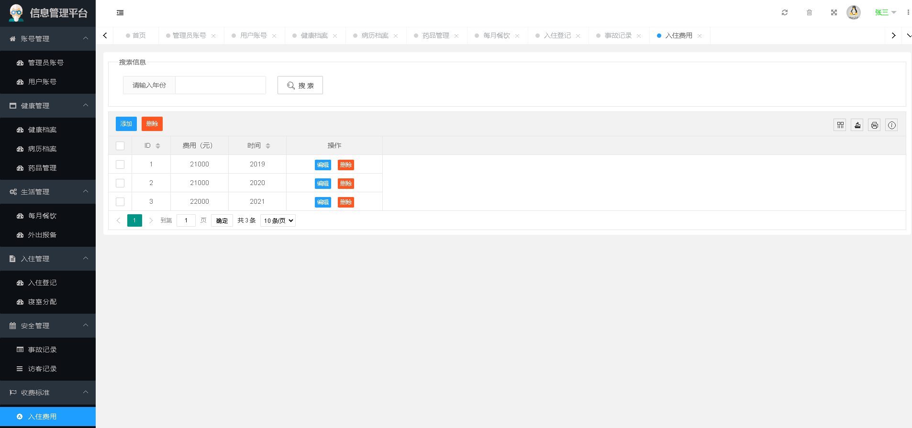

# old-manager-main

毕业设计01：主题“敬老院管理系统”

[基于Springboot、mysql的]敬老院管理系统

项目完整代码已上传，包含必要代码备注

数据库私聊获取：

email：xiehdwork@163.com

wx:15349843018

项目部署+指导；论文指导；答辩细节指导......

#### 系统部分页面：

1. 系统登录页面：

2. 菜单-管理员

3. 菜单-健康管理

4. 菜单-生活管理

5. 菜单-入住管理

6. 菜单-安全管理

7. 菜单-收费标准

